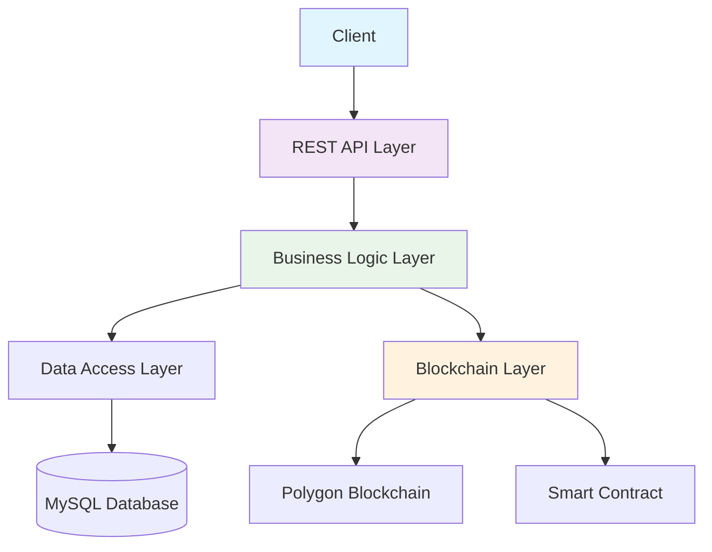

# 🎓 Blockchain Certificate Verification System

> A production-ready, blockchain-based academic certificate verification platform that ensures immutability and transparency using Polygon network.

## 📋 Table of Contents
- [Overview](#-overview)
- [Features](#-features)
- [Architecture](#-architecture)
- [Tech Stack](#-tech-stack)
- [Quick Start](#-quick-start)
- [API Documentation](#-api-documentation)
- [Smart Contract](#-smart-contract)
- [Project Structure](#-project-structure)
- [Setup & Configuration](#-setup--configuration)
- [Testing](#-testing)
- [Learning Experience](#-learning-experience)
- [Future Roadmap](#-future-roadmap)
- [Contributing](#-contributing)
- [License](#-license)
- [Contact](#-contact)

## 🎯 Overview

This system addresses credential fraud by leveraging blockchain technology to issue, verify, and manage academic certificates. Built with enterprise-grade architecture, it combines traditional web technologies with blockchain infrastructure to provide tamper-proof certificate verification.

**Key Problem Solved:** Eliminates certificate forgery through decentralized verification while maintaining user-friendly REST APIs.

## ✨ Features

### ✅ Core Features
- **Blockchain Integration**: Real integration with Polygon Amoy testnet
- **Certificate Lifecycle**: Full CRUD operations with blockchain anchoring
- **Public Verification**: Open endpoints for certificate validation
- **Security**: JWT authentication and Spring Security
- **Database**: MySQL with JPA/Hibernate ORM

### 🔗 Blockchain Features
- Smart contract-based certificate registry
- Gas-optimized transactions
- Testnet and mainnet ready
- Event-driven architecture with blockchain events

### 🛡️ Security Features
- JWT-based authentication
- Role-based access control
- Secure credential management
- Input validation and sanitization

## 🏗️ Architecture



**Layered Architecture:**
1. **Presentation Layer**: REST Controllers
2. **Service Layer**: Business logic and orchestration
3. **Persistence Layer**: Database operations
4. **Blockchain Layer**: Smart contract interactions
5. **Integration Layer**: External services and APIs

## 🛠️ Tech Stack

| Layer | Technology | Purpose |
|-------|------------|---------|
| **Backend** | Spring Boot 3.x, Java 17 | REST API framework |
| **Blockchain** | Solidity, Web3j, Polygon | Smart contracts & integration |
| **Database** | MySQL 8.x, JPA/Hibernate | Data persistence |
| **Security** | Spring Security, JWT | Authentication & authorization |
| **Build Tool** | Maven | Dependency management |
| **Testing** | JUnit 5, Postman | Unit & integration testing |
| **DevOps** | Git, GitHub | Version control & CI/CD |

## 🚀 Quick Start

### Prerequisites
- Java 17 or higher
- Maven 3.8+
- MySQL 8.x
- Node.js (for optional frontend)

### Installation

```bash
# 1. Clone repository
git clone https://github.com/yourusername/blockchain-certificate-system.git
cd blockchain-certificate-system

# 2. Configure database
mysql -u root -p -e "CREATE DATABASE certverify_db;"

# 3. Copy configuration template
cp src/main/resources/application-example.properties \
   src/main/resources/application-local.properties

# 4. Edit local configuration
# Add your database password and blockchain credentials

# 5. Build and run
mvn clean spring-boot:run
```

### Running Modes

```bash
# Development mode (with real blockchain)
mvn spring-boot:run -Dspring-boot.run.profiles=dev

# Demo mode (mock blockchain - no test MATIC needed)
mvn spring-boot:run -Dspring-boot.run.profiles=demo

# Production mode
mvn clean package
java -jar target/certificate-system-1.0.0.jar
```

## 📡 API Documentation

### Base URL
```
http://localhost:8083/api/v1
```

### Key Endpoints

| Method | Endpoint | Description | Authentication |
|--------|----------|-------------|----------------|
| `POST` | `/certificates` | Create new certificate | Required |
| `GET` | `/certificates/{id}` | Get certificate details | Required |
| `POST` | `/blockchain/certificates/{id}/issue` | Issue certificate on blockchain | Required |
| `GET` | `/public/verify/{id}` | Public verification | Public |
| `POST` | `/blockchain/certificates/{id}/revoke` | Revoke certificate | Required |

### Example Request

```bash
# Create Certificate
curl -X POST http://localhost:8083/api/v1/certificates \
  -H "Content-Type: application/json" \
  -H "Authorization: Bearer {jwt_token}" \
  -d '{
    "studentName": "John Doe",
    "course": "Blockchain Fundamentals",
    "issuedDate": "2024-12-31"
  }'
```

## 🔗 Smart Contract

### Contract Address
- **Testnet**: `0x5FbDB2315678afecb367f032d93F642f64180aa3`
- **Network**: Polygon Amoy (Chain ID: 80002)

### Key Functions
```solidity
function issueCertificate(string memory certificateId, string memory studentName, string memory course)
function verifyCertificate(string memory certificateId) returns (bool valid, address issuer, uint256 issuedAt)
function revokeCertificate(string memory certificateId)
```

### Deployment
```bash
# Using Hardhat
npx hardhat run scripts/deploy.js --network amoy

# Using Remix IDE
# Import CertificateRegistry.sol and deploy to Polygon Amoy
```

## 📁 Project Structure

```
src/main/java/com/blockchain/certificate/
├── config/              # Configuration classes
│   ├── Web3Config.java           # Blockchain configuration
│   ├── SecurityConfig.java       # Security settings
│   └── JwtConfig.java            # JWT configuration
├── controller/          # REST endpoints
│   ├── CertificateController.java
│   ├── BlockchainController.java
│   └── PublicVerificationController.java
├── service/            # Business logic
│   ├── CertificateService.java
│   └── BlockchainServiceImpl.java
├── repository/         # Data access
│   └── CertificateRepository.java
├── model/              # Domain models
│   ├── Certificate.java
│   ├── CertificateRequest.java
│   └── CertificateResponse.java
└── BlockchainApplication.java   # Main application class

smart-contracts/
└── CertificateRegistry.sol      # Solidity smart contract
```

## ⚙️ Setup & Configuration

### Database Setup
```sql
-- Create database and user
CREATE DATABASE certverify_db CHARACTER SET utf8mb4 COLLATE utf8mb4_unicode_ci;
CREATE USER 'certuser'@'localhost' identified by 'secure_password';
GRANT ALL PRIVILEGES ON certverify_db.* TO 'certuser'@'localhost';
FLUSH PRIVILEGES;
```

### Environment Variables
Create `.env` file (not committed to Git):
```bash
DB_PASSWORD=your_database_password
JWT_SECRET=your_jwt_secret_key_min_32_chars
BLOCKCHAIN_PRIVATE_KEY=your_private_key_0x...
```

### Configuration Files
- **`application.properties`**: Base configuration with placeholders
- **`application-local.properties`**: Local overrides (gitignored)
- **`application-example.properties`**: Example configuration template

## 🧪 Testing

### API Testing with Postman
Import the provided Postman collection:
```
postman/Blockchain-Certificate-API.postman_collection.json
```

### Unit Tests
```bash
# Run all tests
mvn test

# Run with coverage report
mvn test jacoco:report
```

### Blockchain Testing
```bash
# Test smart contract with Hardhat
npx hardhat test

# Test on local Ganache
npx hardhat node
npx hardhat run scripts/test-contract.js --network localhost
```

## 📚 Learning Experience

This project provided hands-on experience with:

### Blockchain Concepts Mastered
- **Gas Economics**: Understanding transaction costs and optimization
- **Testnet Development**: Working with Polygon Amoy testnet
- **Smart Contract Integration**: Web3j library for Java-Solidity communication
- **Wallet Management**: Secure private key handling

### Engineering Challenges Solved
1. **Real Blockchain Integration**: Connected to live testnet, handled real transactions
2. **Error Handling**: Implemented comprehensive error handling for blockchain failures
3. **Performance Optimization**: Database indexing and query optimization
4. **Security Implementation**: JWT authentication with proper token management

### Production Readiness
- Environment-based configuration
- Comprehensive logging
- Health checks and monitoring endpoints
- Database migration support

## 🗺️ Future Roadmap

### Phase 1: Enhancements (Q1 2025)
- [ ] Docker containerization
- [ ] Swagger/OpenAPI documentation
- [ ] Frontend dashboard with React
- [ ] Email notifications

### Phase 2: Scaling (Q2 2025)
- [ ] Multi-chain support (Ethereum, BSC)
- [ ] IPFS integration for document storage
- [ ] Advanced analytics dashboard
- [ ] Mobile application

### Phase 3: Enterprise (Q3 2025)
- [ ] OAuth2 integration
- [ ] Audit logging
- [ ] Role-based certificate templates
- [ ] Bulk certificate operations

## 🤝 Contributing

Contributions are welcome! Please follow these steps:

1. Fork the repository
2. Create a feature branch (`git checkout -b feature/AmazingFeature`)
3. Commit changes (`git commit -m 'Add AmazingFeature'`)
4. Push to branch (`git push origin feature/AmazingFeature`)
5. Open a Pull Request

### Development Guidelines
- Follow Google Java Style Guide
- Write comprehensive unit tests
- Update documentation for new features
- Ensure backward compatibility

## 📄 License

This project is licensed under the MIT License - see the [LICENSE](LICENSE) file for details.

## 👤 Contact

**Your Name** - [emmanuelike091322@gmail.com](mailto:emmanuelike091322@gmail.com)

Project Link: [https://github.com/Emmatuit/blockchain-certificate-system](https://github.com/Emmatuit/blockchain-certificate-system)

## 🙏 Acknowledgments

- [Spring Boot](https://spring.io/projects/spring-boot) - The web framework used
- [Web3j](https://docs.web3j.io/) - Java integration with Ethereum
- [Polygon](https://polygon.technology/) - Blockchain network
- [MySQL](https://www.mysql.com/) - Database system

---

<div align="center">
  
**⭐ Star this repo if you found it useful!**

[](https://github.com/yourusername/blockchain-certificate-system)
[](https://opensource.org/licenses/MIT)
[](https://www.oracle.com/java/)
[](https://spring.io/projects/spring-boot)

</div>
```

## **📂 Complete GitHub Repository Structure:**

Create these files in your project root:

### **1. `README.md`** (The file above)

### **2. `LICENSE`** (MIT License)
```text
MIT License

Copyright (c) 2024 Your Name

Permission is hereby granted...
[Copy full MIT license from: https://opensource.org/licenses/MIT]
```

### **3. `.gitignore`**
```gitignore
# Compiled class file
*.class

# Log file
*.log

# BlueJ files
*.ctxt

# Package Files
*.jar
*.war
*.nar
*.ear
*.zip
*.tar.gz
*.rar

# Maven
target/
pom.xml.tag
pom.xml.releaseBackup
pom.xml.versionsBackup
pom.xml.next
release.properties
dependency-reduced-pom.xml
buildNumber.properties
.mvn/timing.properties
.mvn/wrapper/maven-wrapper.jar

# IDE
.idea/
*.iws
*.iml
*.ipr
.vscode/
.settings/
.classpath
.project
*.launch
bin/

# Spring Boot
application-local.properties
application-dev.properties
*.private.*
.env
secrets/

# Database
*.db
*.sql
*.h2.db

# OS
.DS_Store
Thumbs.db

# Logs
logs/
*.log.*

# Temp
tmp/
temp/
```

### **4. Create Configuration Files:**

**`src/main/resources/application.properties`:**
```properties
# Database
spring.datasource.url=${DB_URL:jdbc:mysql://localhost:3306/certverify_db?useSSL=false&serverTimezone=UTC}
spring.datasource.username=${DB_USERNAME:root}
spring.datasource.password=${DB_PASSWORD:}
spring.datasource.driver-class-name=com.mysql.cj.jdbc.Driver

# JPA/Hibernate
spring.jpa.hibernate.ddl-auto=update
spring.jpa.show-sql=true
spring.jpa.properties.hibernate.dialect=org.hibernate.dialect.MySQLDialect
spring.jpa.properties.hibernate.format_sql=true

# Connection pool
spring.datasource.hikari.connection-timeout=20000
spring.datasource.hikari.maximum-pool-size=10

# JWT
jwt.secret=${JWT_SECRET:mySuperSecretKeyForJWT256BitEncryption!@}
jwt.expiration=86400000

# Server
server.port=8083

# Blockchain (USE PLACEHOLDERS)
blockchain.private.key=${BLOCKCHAIN_PRIVATE_KEY:}
blockchain.contract.address=${BLOCKCHAIN_CONTRACT_ADDRESS:}
blockchain.rpc.url=${BLOCKCHAIN_RPC_URL:https://rpc-amoy.polygon.technology}
blockchain.chain.id=${BLOCKCHAIN_CHAIN_ID:80002}
```

**`src/main/resources/application-example.properties`:**
```properties
# Example Configuration - Copy to application-local.properties
# DO NOT COMMIT REAL CREDENTIALS TO GIT

# Database
spring.datasource.password=your_database_password_here

# JWT
jwt.secret=your_32_character_jwt_secret_key_here

# Blockchain
blockchain.private.key=your_private_key_0x...
blockchain.contract.address=your_smart_contract_address_0x...
```

## **🚀 Upload to GitHub:**

```bash
# Initialize repository
git init

# Add all files
git add .

# Commit with professional message
git commit -m "Initial commit: Blockchain Certificate Verification System

- Complete REST API with Spring Boot
- Real blockchain integration with Polygon Amoy
- Smart contract for certificate management
- MySQL database with JPA
- JWT authentication & Spring Security
- Production-ready architecture
- Comprehensive documentation"

# Connect to GitHub (create repo first at github.com)
git remote add origin https://github.com/Emmatuit/blockchain-certificate-system.git
git branch -M main
git push -u origin main
```

